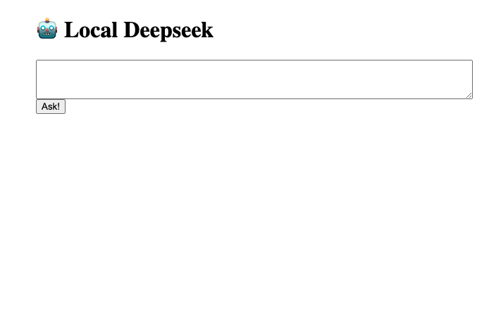
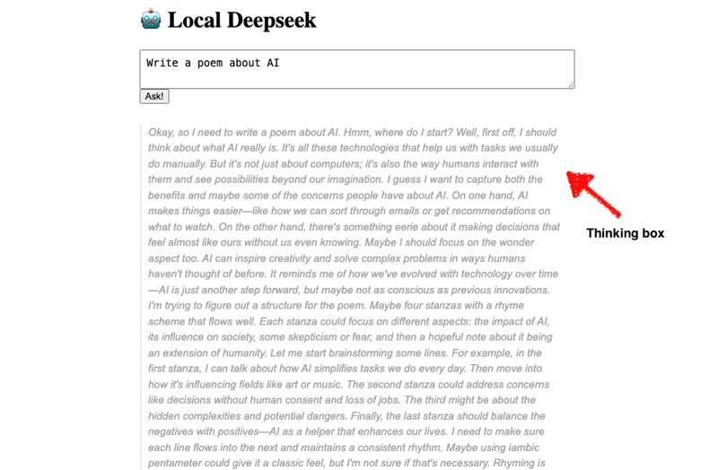
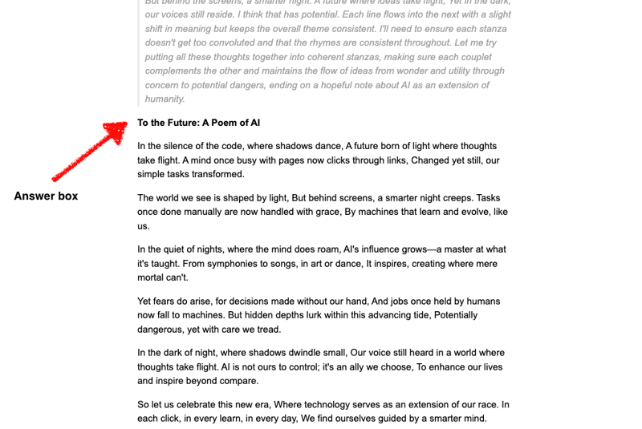

# Run Deepseek-R1 Locally on your Host Machine with Docker

## Prerequisites
You must have [Docker](https://www.docker.com/get-started/) and [Docker Compose](https://docs.docker.com/compose/install/) installed on your system.


## Instructions to Install and Run DeepSeek-R1 Model

1. Run the two apps from Docker Compose:

```sh
docker compose up -d
```

2. **Download the Deepseek model:**

Once the containers are running, you need to download the Deepseek language model. This command executes within the `ollama` container to pull the `deepseek-r1:7b` model from the Ollama library.

- **Model Size:** The `deepseek-r1:7b` model has 7 billion parameters and is approximately 4.7 GB in size. [See the full list of options here](https://www.ollama.com/library/deepseek-r1) This will be saved on our local computer in the volume mount we specified: ./ollama-models/models/manifests
- **Storage:** Ollama models are stored in volumes, ensuring persistence across container restarts. The `docker-compose.yml` defines a volume mount (e.g., `./ollama-models:/root/.ollama`) so models will be saved on your local computer within the `./ollama-models` directory.
- **Explore other models:** If you wish to use different Deepseek models or other language models, you can explore the [Ollama library](https://www.ollama.com/library). Simply replace `deepseek-r1:7b` with the desired model name and tag.

```sh
docker compose exec ollama-container ollama pull deepseek-r1:7b
```
**Note - if you do decide to change the deepseek parameter model, replace 7b with the value you choose to use. Ex: `deepseek-r1:14b` instead of `deepseek-r1:7b`. In addition, update the `response.body.model` property inside ollama.js to use the correct model.**

3. Run the website on http://localhost:3001

## Screenshots

Homepage:



Thinking box:



Answer box:



## Cleaning Up and Removing Model Data

When you are finished experimenting with Deepseek and want to free up disk space, you can remove the downloaded model data (which takes up about 4.7 GB data for 7b parameter model).  Since the models are stored in the `./ollama-models` directory on your local machine (due to the volume mount in `docker-compose.yml`), the easiest way to remove them is to delete this directory.

**Follow these steps to clean up:**

1.  **Stop the Docker containers:**  Navigate to the directory containing your `docker-compose.yml` file in your terminal and run:

    ```sh
    docker compose down
    ```

2.  **Remove the `ollama-models` directory:**

    Delete the `ollama-models` directory from your local machine.  Choose the command appropriate for your operating system:

    *   **Linux/macOS (using Terminal):**

        ```sh
        rm -rf ./ollama-models
        ```

    *   **Windows (using Command Prompt):**

        ```cmd
        rd /s /q ollama-models
        ```

    *   **Windows (using PowerShell):**

        ```powershell
        Remove-Item -Path ./ollama-models -Recurse -Force
        ```

    *   **Using File Explorer (Windows/macOS):** You can also manually delete the `ollama-models` folder using your operating system's file explorer. Just right click the folder and select delete option.

3.  **Verify disk space:** Check your disk space to confirm that the space used by the models has been recovered.

> [!IMPORTANT]
> **Important Note about Bind Mounts:**
>
> This cleanup method works because we are using a **bind mount** in our `docker-compose.yml`. With bind mounts, the data is directly stored on your host machine. If you were using **named volumes** instead, the cleanup process would be different and would typically involve using Docker volume commands (like `docker volume rm` or `docker compose down -v`). However, for this setup with a bind mount, deleting the local directory is the most straightforward and effective approach.

## Source Article
[Run Deepseek Locally Using Docker by Savvas Stefhani](https://dev.to/savvasstephnds/run-deepseek-locally-using-docker-2pdm)
